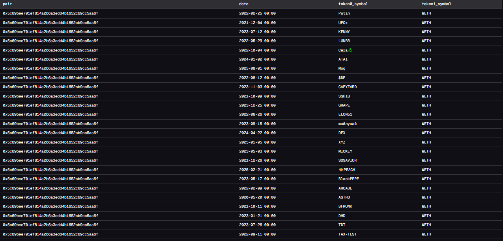

# 📊 Uniswap V2 – Liquidity Pair Tracker (WETH & USDC)

This project analyzes newly created liquidity pairs on **Uniswap V2 (Ethereum)** that include either **WETH** or **USDC**.  
It helps track early token listings, liquidity events, and potential new market activity.

---

## 📌 Objective

Identify and analyze:

- 🆕 New Uniswap V2 pairs at creation
- 🪙 Tokens paired with WETH or USDC
- 📅 Date of pair creation
- 📍 Pair contract addresses

---

## 🧠 Why This Is Useful

This project is valuable for:

- Detecting new token launches
- Monitoring early liquidity injections
- Spotting trends & narrative cycles
- Flagging possible opportunities or risks

---

## 🛠️ SQL Query (Dune)

```sql
SELECT
  p.contract_address as pair,
  date_trunc('day', p.evt_block_date) as date,
  t0.symbol as token0_symbol,
  t1.symbol as token1_symbol
FROM uniswap_v2_ethereum.Factory_evt_PairCreated p
LEFT JOIN tokens.erc20 t0
  ON t0.contract_address = p.token0
LEFT JOIN tokens.erc20 t1
  ON p.token1 = t1.contract
WHERE p.token0 in (
    0xC02aaA39b223FE8D0A0e5C4F27eAD9083C756Cc2, -- WETH
    0xA0b86991c6218b36c1d19D4a2e9Eb0cE3606eB48  -- USDC
  )
  OR p.token1 in (
    0xC02aaA39b223FE8D0A0e5C4F27eAD9083C756Cc2,
    0xA0b86991c6218b36c1d19D4a2e9Eb0cE3606eB48
  )
  AND t1.blockchain = 'ethereum'
  AND t0.blockchain = 'ethereum';
```

the result of DUne



```sql
SELECT
    p.contract_address as pair_address,
    date_trunc('day',p.evt_block_date) as date_by_day,
    t0.symbol as token0_symbol,
    p.token0,
    t1.symbol as token1_symbol,
    p.token1
FROM
    uniswap_v2_ethereum.Factory_evt_PairCreated p
  LEFT JOIN tokens.erc20 t0 ON t0.contract_address = p.token0
  LEFT JOIN tokens.erc20 t1 ON t1.contract_address = p.token1
WHERE  p.token0 in (0xC02aaA39b223FE8D0A0e5C4F27eAD9083C756Cc2,0xA0b86991c6218b36c1d19D4a2e9Eb0cE3606eB48)
    AND p.token1 in (0xC02aaA39b223FE8D0A0e5C4F27eAD9083C756Cc2,0xA0b86991c6218b36c1d19D4a2e9Eb0cE3606eB48)
AND t0.blockchain = 'ethereum' and t1.blockchain = 'ethereum';

```
